# From Experiments to Workflows: Use Cases

This repository contains the test models, generated workflows, and setup instructions
for the research project *"From Experiments to Workflows"*.

The project consists of two parts:
1. **QHAna timeline export**: Generating executable workflows from QHAna experiment
   timeline steps (validated with the MUSE experiment).
2. **Low-code backend extension**: Transforming quantum low-code models into executable
   workflows, supporting fixed-value models, placeholder models, and plugin models.

   ## Contents

- [Repository Structure](#repository-structure)
- [Prerequisites](#prerequisites)
- [Setup](#setup)
  - [Step 1: QuantME environment](#step-1-start-the-quantme-environment-camunda-winery-etc)
  - [Step 2: Qunicorn](#step-2-start-qunicorn)
  - [Step 3: Low-code modeler and backend](#step-3-start-the-low-code-modeler-and-backend)
  - [Step 4: QHAna environment](#step-4-start-the-qhana-environment)
- [Use Case 1: QHAna MUSE Experiment](#use-case-1-qhana-muse-experiment-timeline-export)
- [Use Case 2: Low-Code Backend](#use-case-2-low-code-backend-workflow-generation)
- [References](#references)

## Repository Structure

```
.
├── qhana-muse/
│   └── muse-workflow.bpmn              # Generated workflow from the MUSE experiment
├── low-code-backend/
│   ├── models/
│   │   ├── fixed-value-model.json      # Test model without placeholders
│   │   ├── placeholder-model.json      # Test model with a placeholder value
│   │   └── plugin-model.json           # Test model with Classical K-Means plugin
│   └── workflows/
│       ├── fixed-value-workflow.bpmn   # Generated workflow for fixed-value model
│       ├── placeholder-workflow.bpmn   # Generated workflow for placeholder model
│       ├── plugin-workflow.bpmn        # Generated workflow for plugin model
│       └── qrms/
│           └── qrms.zip               # Generated QRMs for quantum groups
└── README.md
```

## Prerequisites

- [Docker](https://www.docker.com/) and Docker Compose
- [Node.js](https://nodejs.org/) (for the low-code modeler and backend)
- A web browser

## Setup

The setup consists of four groups of services that need to be started separately.

### Step 1: Start the QuantME environment (Camunda, Winery, etc.)

Clone and start the QuantME-UseCases Docker environment:

```bash
git clone -b fix/2025-icse-docker https://github.com/UST-QuAntiL/QuantME-UseCases.git
cd QuantME-UseCases/2025-icse/docker
docker-compose pull
docker-compose up -d
```

This starts the following relevant services:

| Service            | URL                        | Description                              |
|--------------------|----------------------------|------------------------------------------|
| Workflow Modeler   | http://localhost:1893      | QuantME workflow editor                  |
| Camunda Engine     | http://localhost:8090      | Workflow engine for executing workflows  |
| Winery             | http://localhost:8093      | TOSCA service template repository        |

Wait until all services are running before proceeding.

### Step 2: Start Qunicorn

Clone the Qunicorn repository and replace the default `docker-compose.yml` with the
provided configuration:

```bash
git clone https://github.com/qunicorn/qunicorn-core.git
cd qunicorn-core
```

Replace the `docker-compose.yml` with the version from this repository or from
`/docker-compose.yaml`, then start the services:

```bash
docker-compose pull
docker-compose up -d
```

| Service          | URL                        | Description                                    |
|------------------|----------------------------|------------------------------------------------|
| Qunicorn Server  | http://localhost:8080      | Quantum circuit execution middleware           |
| Qunicorn Worker  | (internal)                 | Background worker for quantum job execution    |
| Keycloak         | http://localhost:8041      | Authentication service                         |

### Step 3: Start the low-code modeler and backend

Clone and start the low-code modeler:

```bash
git clone https://github.com/LEQO-Framework/low-code-modeler.git
cd low-code-modeler
npm install
npm run dev
```

In a separate terminal, clone and start the low-code backend:

```bash
git clone https://github.com/LEQO-Framework/leqo-backend.git
cd leqo-backend
# Follow the setup instructions in the repository's README
```

| Service            | URL                        | Description                                      |
|--------------------|----------------------------|--------------------------------------------------|
| Low-Code Modeler   | http://localhost:4242      | Visual editor for quantum low-code models        |
| Low-Code Backend   | http://localhost:8000      | Transformation pipeline and workflow generation  |

### Step 4: Start the QHAna environment

This step is required for the MUSE experiment (QHAna timeline export) and for testing low-code models with ML nodes (e.g., Classical K-Means).

Start the QHAna backend services via Docker:

```bash
git clone https://github.com/UST-QuAntiL/qhana-docker.git
cd qhana-docker
docker-compose pull
docker-compose up -d
```

In a separate terminal, start the QHAna UI:

```bash
git clone https://github.com/UST-QuAntiL/qhana-ui.git
cd qhana-ui
npm install
ng serve
```

| Service             | URL                        | Description                                  |
|---------------------|----------------------------|----------------------------------------------|
| QHAna UI            | http://localhost:4200      | Web interface for QHAna experiments          |
| QHAna Plugin Runner | http://localhost:5005      | Executes ML plugins (e.g., Classical K-Means)|

---

## Usage 1: QHAna MUSE Experiment (Timeline Export)

This use case demonstrates the workflow generation from QHAna experiment timeline steps,
as described in Sections 4.1, 5.1, and 6.1 of the paper.

### Running the MUSE experiment

1. Open the QHAna UI at http://localhost:4200.
2. Create a new experiment or open an existing one.
3. Follow the MUSE experiment guide at
   https://qhana.readthedocs.io/en/latest/muse.html to execute the seven steps:
   - costume-loader
   - wu-palmer
   - sym-max-mean
   - sim-to-dist-transformers
   - distance-aggregator
   - mds
   - classical-k-means
4. After all steps have been executed, they appear in the experiment timeline.

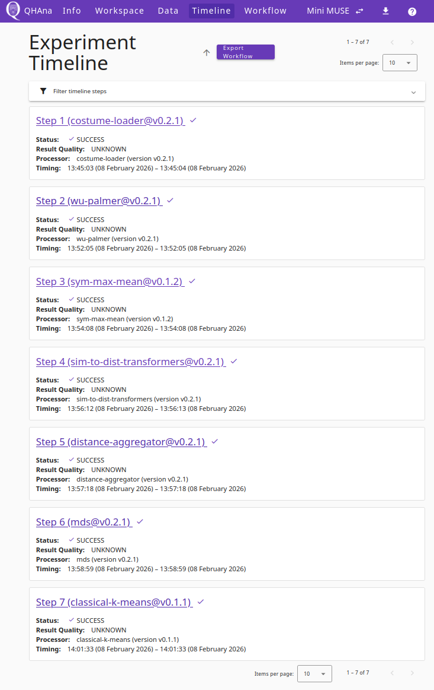

### Exporting the workflow

1. Click the **Export Workflow** button in the timeline header.
2. In the step selection dialog, all seven steps are listed and selected by default.
   Optionally, use the quality filter to filter steps by their result quality.

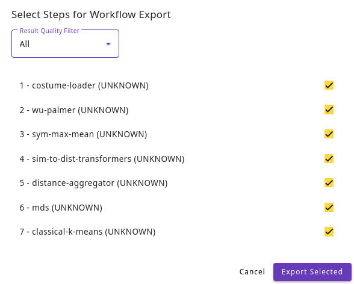

3. Click **Export Selected** to generate the workflow.
4. The system enriches the selected steps, generates a workflow, and navigates
   to the workflow editor tab.

### Transforming and executing the workflow

1. In the workflow editor, the generated workflow is listed under "Load Saved Workflow".
   Open it to see the seven steps modeled as QHAna service tasks.
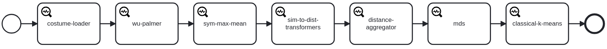

The generated workflow can be found in [`qhana-muse/muse-workflow.xml`](graphics/muse-workflow.xml).

2. Click **Transformation** in the top bar to convert the QHAna service tasks into
   executable BPMN service tasks.
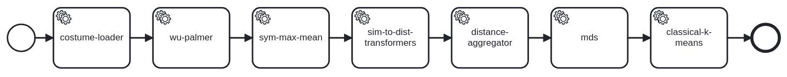

The generated BPMN workflow can be found in [`qhana-muse/muse-workflow_transformed.bpmn`](graphics/muse-workflow_transformed.bpmn).

3. Verify that input and output mappings are correct:
   - The `costume-loader` plugin has no preceding step, so its parameters appear as
     start form fields.
   - The `wu-palmer` plugin receives its input from the output of `costume-loader`.
   - The output parameter of the last step (`classical-k-means`) is prefixed with
     `return.` to mark it as the process return value.
4. Click **Deploy Workflow** to deploy the transformed workflow.
5. The workflow appears as a new plugin in the workspace. Fill in the form fields
   (all fields except the database password are pre-filled with default values).
   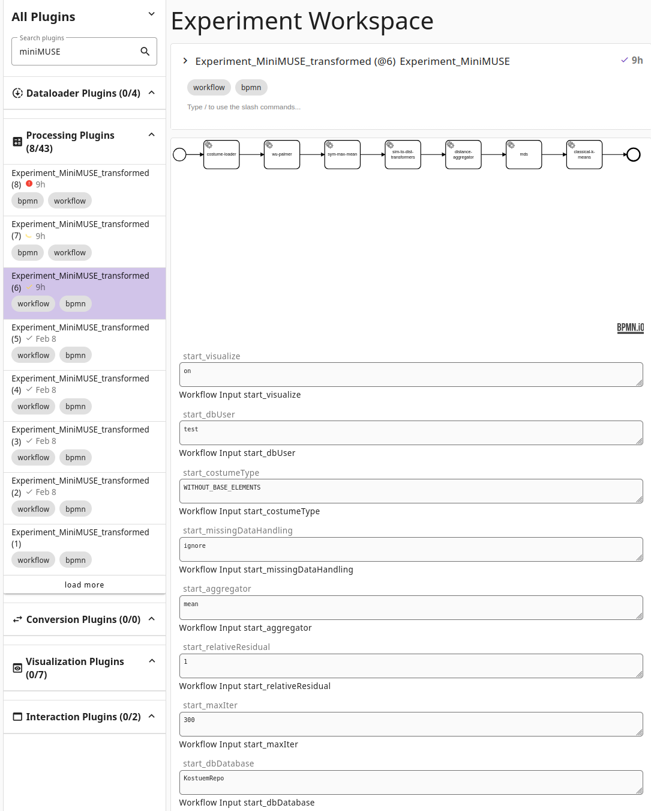
6. Submit the plugin. The process should terminate without errors.
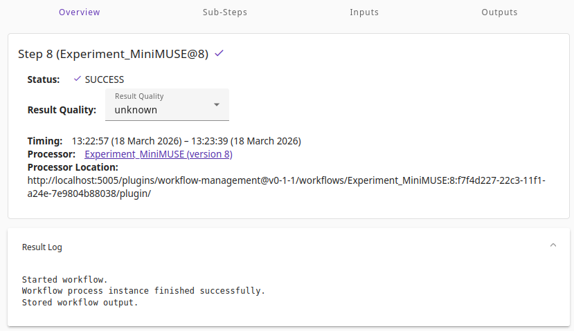

7. Check the results in the timeline tab under "Outputs". The output should contain
   the same clustering result as the original manual MUSE experiment execution.

   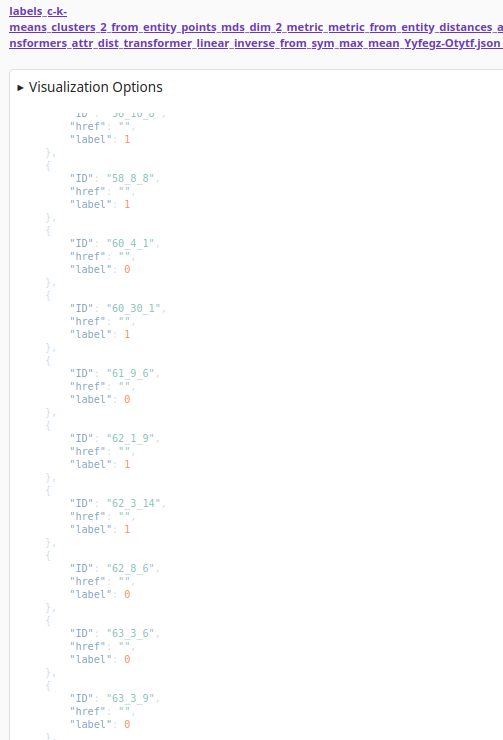
   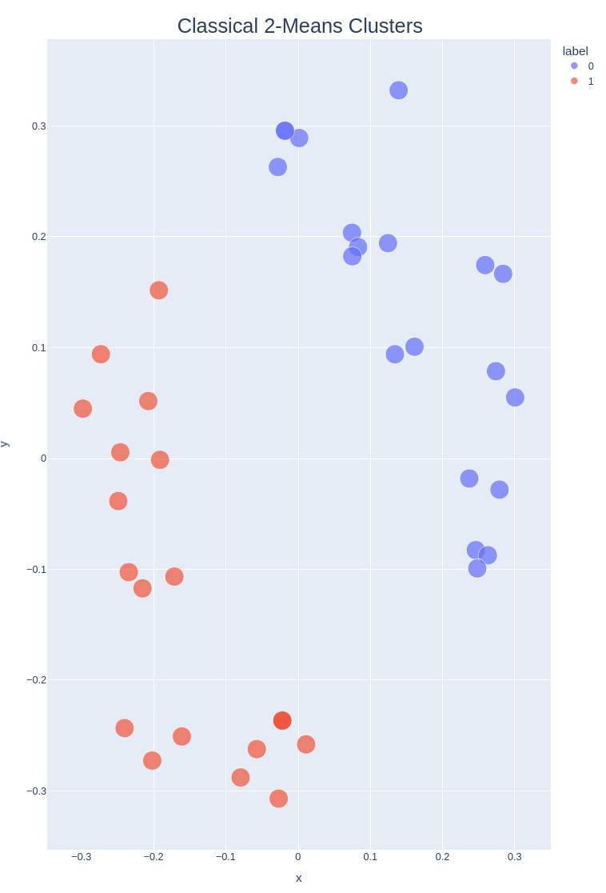 


---

## Use Case 2: Low-Code Backend (Workflow Generation)

This use case demonstrates the transformation of quantum low-code models into executable
workflows, as described in Sections 4.2, 5.2, and 6.2 of the paper.

### Loading a test model

1. Open the low-code modeler at http://localhost:4242.
2. Import one of the test models from the [low-code-backend/models/](low-code-backend/models/) directory.

The following three models are provided:

**Fixed-Value Model:**
A qubit node, a register node, a Hadamard gate, and a Measurement node connected
sequentially. All values are specified directly. This model generates a standard
workflow that compiles the circuit at generation time and executes it via Qunicorn.

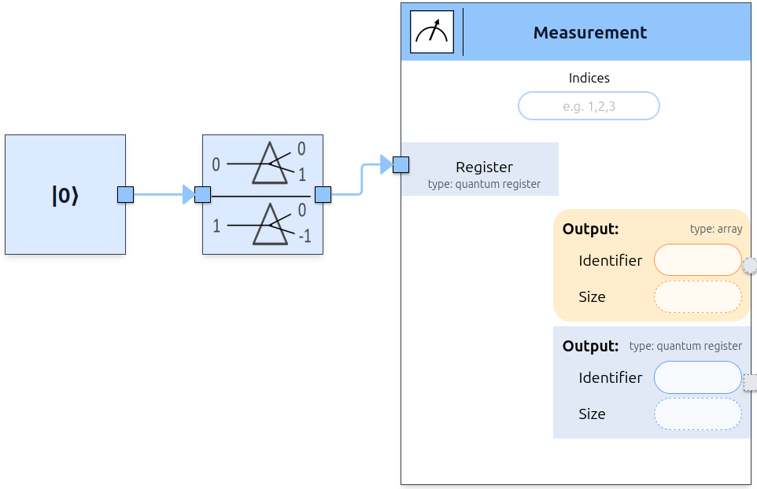

**Placeholder Model:**
A Number node, a Basis Encoding node, and a Measurement node connected sequentially.
The Number node's value is set to a placeholder variable instead of a concrete number.
This model generates a placeholder workflow where the user provides the value at runtime
through a Camunda form field.
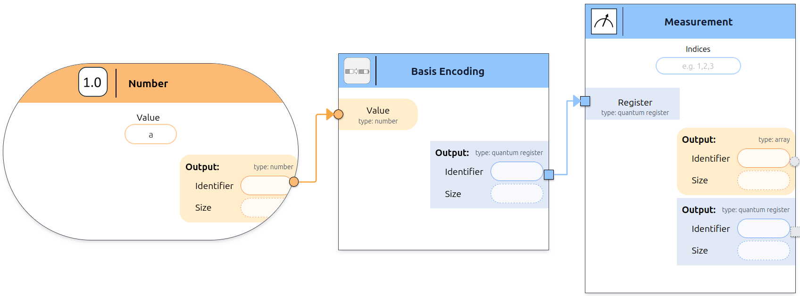

**Plugin Model:**
A File node, a Number node, and a Classical Clustering (K-Means) plugin node.
The File node provides the entity points URL, the Number node specifies the number of
clusters. This model generates a plugin workflow that calls the QHAna plugin runner.

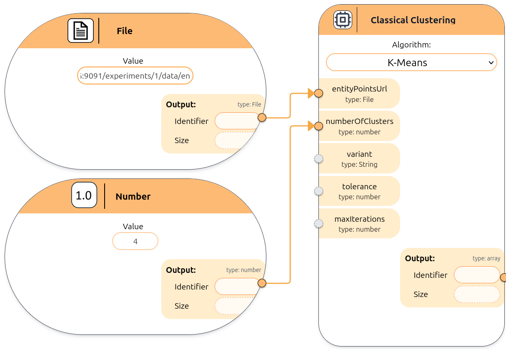

### Generating the workflow

1. Click the **Send to Backend** button in the modeler with the compilation target set to
   **workflow**.
   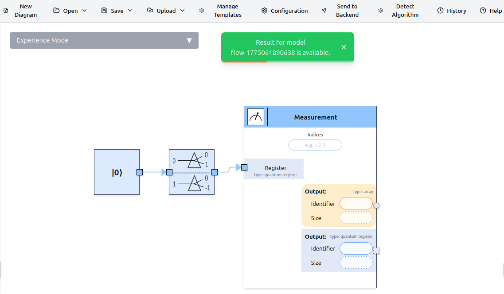
2. Wait for the backend to generate the workflow. The status can be tracked in the
   modeler's history view.
3. Once the status is **completed**, download the generated workflow and the QRM
   archive (if the model contains quantum elements).
   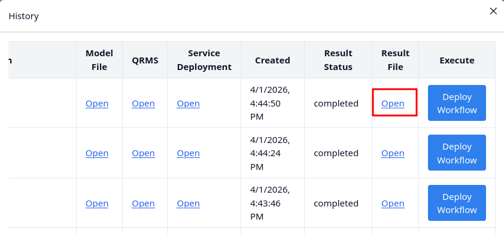


Alternatively, you can use the pre-generated workflows from the [low-code-backend/workflows/](low-code-backend/workflows/) directory.

### Deploying in Workflow Editor

1. Open the Workflow Editor at http://localhost:1893.
2. Open downloaded bpmn workflow.
   -  Fixed-Value workflow
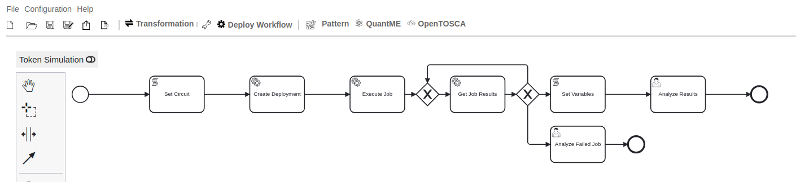
   -  Workflow containing a placeholder
   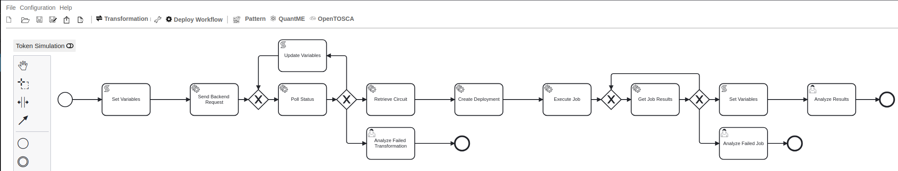
   -  Workflow containing a plugin node
   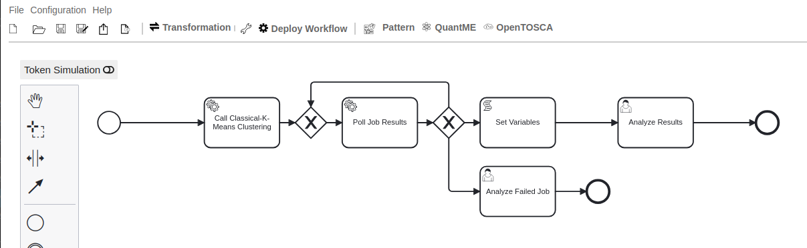
3. Click the Deploy Workflow button in the Workflow Editor.

### Executing in Camunda

1. Open the Camunda web interface at http://localhost:8090.
2. Log in with the credentials **demo / demo**.
3. Start a new process instance:
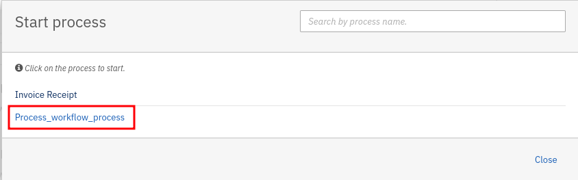
4. Fill in the required form fields:
   - **IP Address**: The IP address of the host machine (e.g., `localhost`)
   - **Qunicorn Port**: `8080`
   - **Backend Port**: `8000`
   - **Plugin Port**: `5005` (only for plugin models)
   - **Placeholder** (only for placeholder models): The value to substitute
   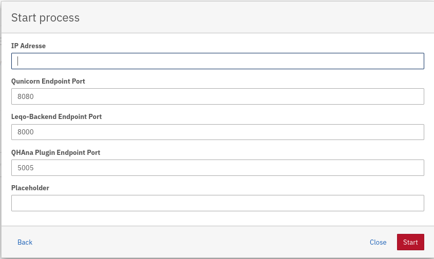
5. Open the **Cockpit** to monitor the running process instance.
6. The process token should advance through the tasks and reach the
   **Analyze Results** user task.
   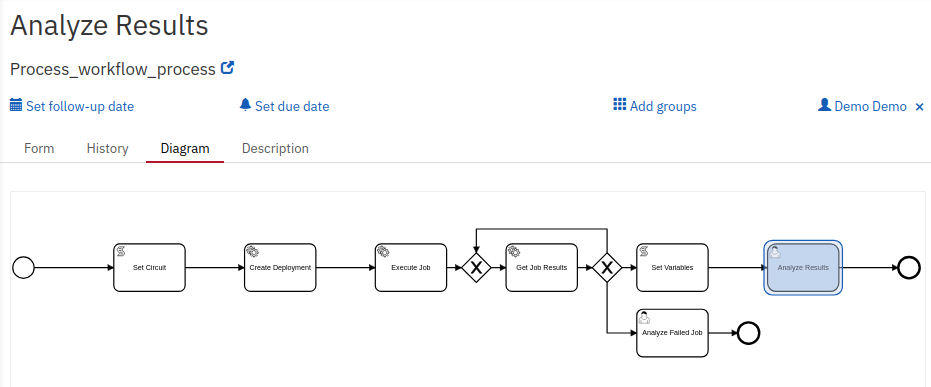
7. Open the Task List and Claim the Task:
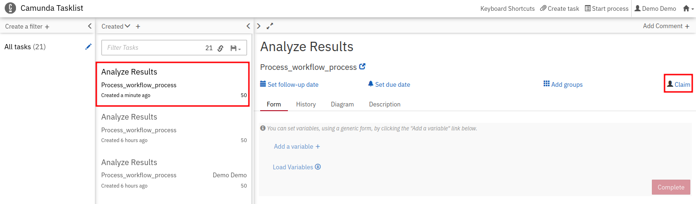
8. Check the results in the Form tab under "resultExecution": 


### Results

#### Fixed-Value Model
Since
the test model applies a Hadamard gate to a single qubit initialized in the |0⟩ state, the expected
measurement result is an approximately equal distribution between 0 and 1. The results returned
by Qunicorn confirmed this: the measured probabilities were close to 50 % for each outcome,
which matches the theoretical prediction for this circuit.
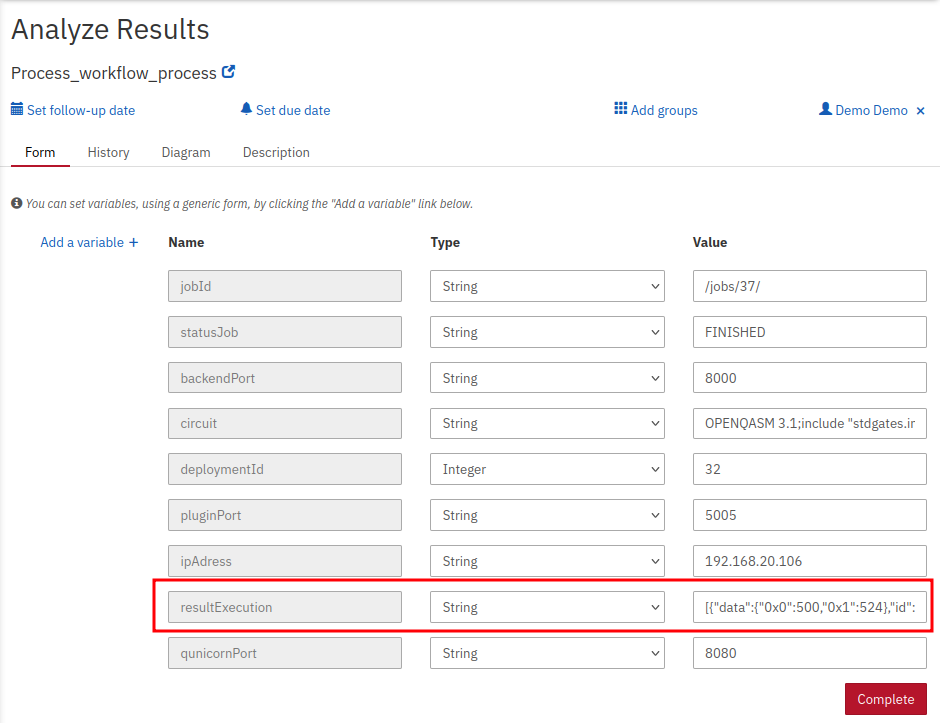

#### Placeholder Model
Since the test model uses basis encoding, the measurement result is deterministic: basis
encoding maps a number to its binary representation in qubits. For the input value 47, the binary
representation is 101111, which requires six qubits. The backend dynamically allocated six qubits
and the measurement returned the hex value 0x2f, which corresponds exactly to the decimal value
47. This deterministic result confirms that the placeholder substitution, the dynamic compilation,
and the subsequent quantum execution all work correctly together.
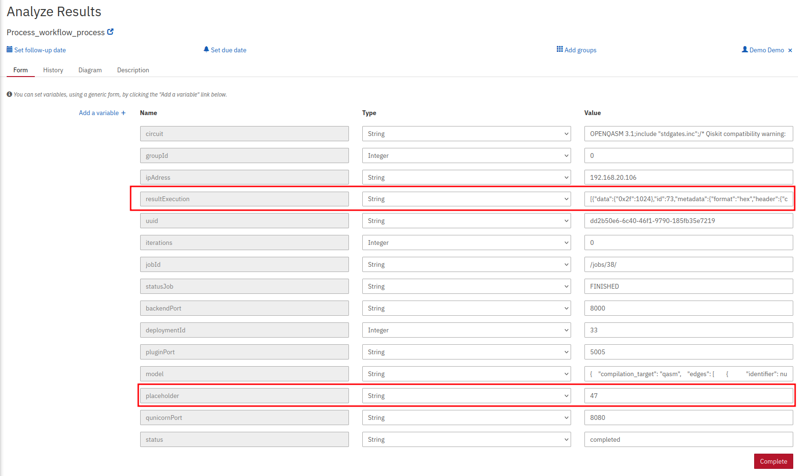

#### Plugin Model
We retrieved the clustering result via the output URLs and verified that every data point received
a cluster label between 0 and 3, matching the requested number of four clusters. This confirms
that the plugin received the correct parameters (entity points URL and number of clusters) from
the workflow and produced a valid clustering.
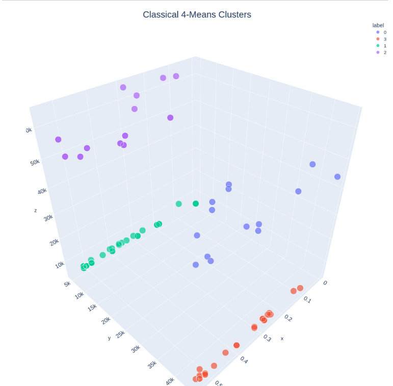

## References

- [LEQO Low-Code Modeler](https://github.com/LEQO-Framework/low-code-modeler)
- [LEQO Low-Code Backend](https://github.com/LEQO-Framework/leqo-backend)
- [Qunicorn](https://github.com/qunicorn/qunicorn-core)
- [QuantME-UseCases](https://github.com/UST-QuAntiL/QuantME-UseCases)
- [QHAna Docker](https://github.com/UST-QuAntiL/qhana-docker)
- [MUSE Experiment Guide](https://qhana.readthedocs.io/en/latest/muse.html)


## Haftungsausschluss

Dies ist ein Forschungsprojekt. Die Haftung für entgangenen Gewinn, Produktionsausfall, Betriebsunterbrechung, entgangene Nutzungen, Verlust von Daten und Informationen, Finanzierungsaufwendungen sowie sonstige Vermögens- und Folgeschäden ist, außer in Fällen von grober Fahrlässigkeit, Vorsatz und Personenschäden, ausgeschlossen.